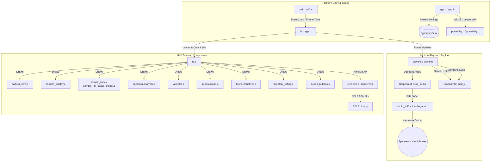

# Hyperplayer SDL Architecture

This document describes the software architecture, design patterns, and components of **Hyperplayer SDL**, a cross-platform desktop Amiga-MOD player written in C11.

---

## 1. High-Level Architecture Overview

Hyperplayer SDL is structured around a decoupled architecture separating **Platform Entry & Event Loop**, **UI & Render Abstraction**, and the **Audio & Decoder Subsystem**.

Below is a diagram of the components and their relationships:

---

## 2. Key Architectural Mechanisms

### 2.1. Dual-Libopenmpt Audio/UI Synchronization Pipeline

Tracker modules (like `.MOD` files) are stateful. When audio samples are rendered by the decoder, the internal row, tempo, ticks, and channel volume parameters advance. 

To prevent stuttering and audio dropouts, a hardware output audio buffer must be pre-filled with about 100 milliseconds of decoded samples. If a single instance of `libopenmpt` was used, the visual interface (highlighting rows in the pattern display, active channels, oscilloscopes) would show the state of the song **100ms in the future**, which ruins the experience of synchronized audio and visualizers.

Hyperplayer solves this by using a **Dual-OpenMPT synchronization model**:

1. **`mod_audio` (The Audio Instance)**: Used solely by the audio render loop. It decodes audio frames into the output buffers and streams them to the speakers. It tracks `totalSamplesRead`.
2. **`mod_ui` (The UI Instance)**: Used solely for retrieving visual state (current pattern, active row, note data, channel volume).
3. **Synchronizer Loop**:
   - In each frame update, Hyperplayer queries the audio buffer latency via `hp_audio_get_queued_frames()`.
   - The **Audible Timestamp** is computed: `audibleSamples = totalSamplesRead - latencySamples`.
   - The UI thread compares `audibleSamples` with `uiSamplesProcessed`.
   - If `mod_ui` is behind the audible timestamp, Hyperplayer decodes dummy frames using `openmpt_module_read_float_stereo` to catch `mod_ui` up to the exact audio sample being played at that moment.
   - If the sync drifts too far (e.g., during order jumps, pauses, or seeks), a hard seek is executed using `openmpt_module_set_position_seconds(mod_ui, audibleSeconds)`.

### 2.2. Abstract Drawing Context (`HP_DrawContext`)

To make the codebase independent of any particular graphics API, all UI drawing logic targets an abstract context defined in [renderer.h](file:///home/johan/repos/hyperplayer/renderer.h):

- **`HP_DrawContext`**: Wraps the drawing state, current font, target surface, text color, and rendering coordinates.
- **Rendering Primitives**: Functions like `hp_draw_fill_rect`, `hp_draw_polyline`, and `hp_draw_text` provide clean primitives.
- **Texture Streaming**: Abstractions like `HP_Texture` allow for real-time visualization buffers (e.g., drawing oscilloscope lines on standard bitmaps and blending them over the background).
- **Backend Implementations**: [renderer.c](file:///home/johan/repos/hyperplayer/renderer.c) maps these calls directly to the **SDL3 Rendering API** (e.g., logical letterboxing at a fixed 1920×1080 resolution, scaling, and double-buffered presentations).

---

## 3. Subsystem Breakdown

### 3.1. Main Loop & Events
- **[main_sdl3.c](file:///home/johan/repos/hyperplayer/main_sdl3.c)**: Program entry point. Initializes SDL3 video, audio, TTF, and image systems. Runs the standard game loop at ~60 FPS with automatic frame rate delay, processes window resizing via logical letterboxing, maps SDL3 events to Hyperplayer keystrokes/mouse inputs, and calls update and draw sequences.
- **[hp_app.c](file:///home/johan/repos/hyperplayer/hp_app.c) / [hp_app.h](file:///home/johan/repos/hyperplayer/hp_app.h)**: Bridges the platform-specific event loop with application business logic, acting as the main state coordinator.

### 3.2. Audio Playback
- **[audio.h](file:///home/johan/repos/hyperplayer/audio.h)**: Defines the audio stream interface.
- **[audio_sdl3.c](file:///home/johan/repos/hyperplayer/audio_sdl3.c)**: Implementation using SDL3's audio stream API.
- **[audio_alsa.c](file:///home/johan/repos/hyperplayer/audio_alsa.c)**: Alternative Linux-only backend implementation demonstrating ALSA PCM device output.
- **[player.c](file:///home/johan/repos/hyperplayer/player.c) / [player.h](file:///home/johan/repos/hyperplayer/player.h)**: Handles the module loader, state changes (play, pause, stop, seek), sample extraction, channel scopes tracking, and the dual-instance sync mechanism.

### 3.3. File Browser
- **[directory_listing.c](file:///home/johan/repos/hyperplayer/directory_listing.c) / [directory_listing.h](file:///home/johan/repos/hyperplayer/directory_listing.h)**: Scans directories, handles path concatenation, filters files (`*.mod` or starting with `mod.`), tracks folder history, and coordinates navigation.

### 3.4. User Interface & Visualizers
- **[ui.c](file:///home/johan/repos/hyperplayer/ui.c) / [ui.h](file:///home/johan/repos/hyperplayer/ui.h)**: Responsible for laying out panels, loading font/texture assets, and drawing backgrounds.
- **[pattern_view.c](file:///home/johan/repos/hyperplayer/pattern_view.c)**: Renders the active module's 4-channel pattern tracker grid, highlighting row lines, note codes, instruments, and effects.
- **[action_buttons.c](file:///home/johan/repos/hyperplayer/action_buttons.c)**: Playback controls (Play, Pause, Stop, Prev, Next, Loop toggles).
- **[sample_list.c](file:///home/johan/repos/hyperplayer/sample_list.c) / [sample_list_usage_trigger.c](file:///home/johan/repos/hyperplayer/sample_list_usage_trigger.c)**: Renders the 31 sample names and sizes. Implements active sample highlights that fade out gradually.
- **[sample_display.c](file:///home/johan/repos/hyperplayer/sample_display.c)**: Cycles through module instruments and renders their corresponding waveforms.
- **[spectrumanalyzer.c](file:///home/johan/repos/hyperplayer/spectrumanalyzer.c)**: Computes and draws a segmented real-time frequency bar display.
- **[vumeter.c](file:///home/johan/repos/hyperplayer/vumeter.c)**: Left and right output volume level meters.
- **[quadrascope.c](file:///home/johan/repos/hyperplayer/quadrascope.c)**: Renders an oscilloscope block for each of the 4 audio channels.
- **[tunnelvisualizer.c](file:///home/johan/repos/hyperplayer/tunnelvisualizer.c)**: A 3D-like radial tunnel visualizer combined with a starfield simulation, moving and pulsating in response to the module's bass frequencies.

### 3.5. System Portability Shim
- **[portability.h](file:///home/johan/repos/hyperplayer/portability.h) / [portability.c](file:///home/johan/repos/hyperplayer/portability.c)**: Defines standard Windows-style Win32 API structures and types (e.g. `HWND`, `DWORD`, `MAX_PATH`) on Unix environments, and implements POSIX fallbacks for Windows API calls (`GetPrivateProfileStringW`, `GetTickCount64`, `ShellExecuteW`, `GetModuleFileNameW`) to ease compilation under Linux.

---

## 4. Configuration & State Management

Application settings are stored in **[hyperplayer.ini](file:///home/johan/repos/hyperplayer/hyperplayer.ini)**.

- **Defaults creation**: If the INI is deleted or missing, `app_ensure_default_ini_exists` copies a default profile into the executable path.
- **Parsed Parameters**: Includes directory path presets, stereo separation levels, UI color codes in hex format (e.g. `TEXTCOLOR1=3648FF`), VU/quadrascope colors, spectrum bands, and starfield/glow performance constants.
